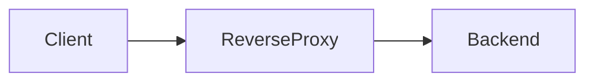
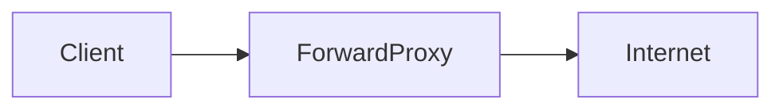
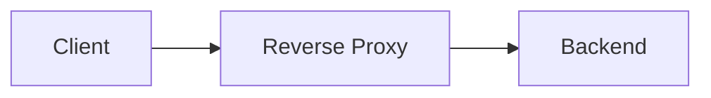
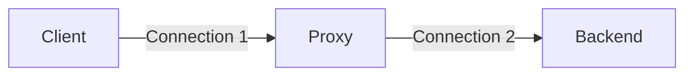
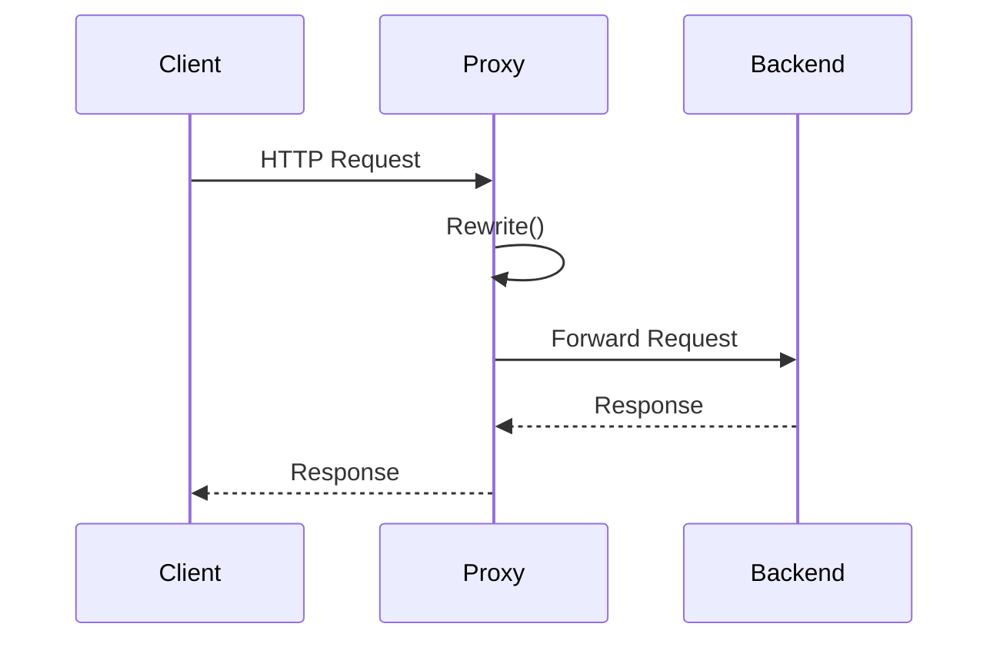
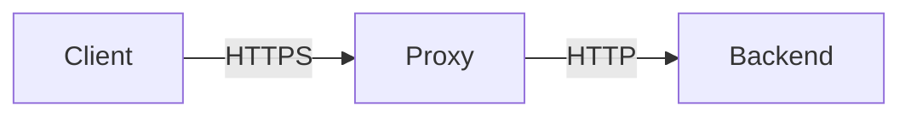
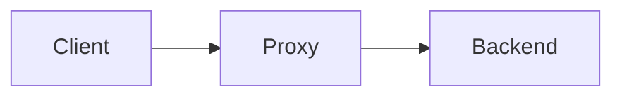
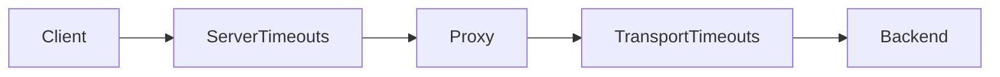

---
slug: day-2
title: Day 2
---
# Day 2 - Reverse Proxy Core (Learning Notes)

> Goal: Understand how Go's `httputil.ReverseProxy` works, why it is designed the way it is, and how to build a secure reverse proxy.

---

# Table of Contents

1. Reverse Proxy vs Forward Proxy
2. ReverseProxy Architecture
3. httputil.ReverseProxy
4. ProxyRequest
5. Rewrite
6. SetURL()
7. SetXForwarded()
8. X-Forwarded Headers
9. Trusted Proxy Boundary
10. Hop-by-Hop Headers
11. End-to-End Headers
12. Connection Reuse
13. Timeouts
14. ErrorHandler
15. HTTP Status Codes
16. Interview Questions
17. Key Takeaways

---

# Reverse Proxy vs Forward Proxy

## Reverse Proxy

A reverse proxy sits **in front of servers**.


The client only knows the reverse proxy.

Examples

- Nginx
- Envoy
- Traefik
- HAProxy
- Go ReverseProxy

### Uses

- Load balancing
- Authentication
- Rate limiting
- TLS termination
- Logging
- Caching
- Request routing

---

## Forward Proxy

A forward proxy sits **in front of clients**.


Example
```
Laptop
      ↓
Corporate Proxy
      ↓
Google
```

---

## Difference

| Reverse Proxy | Forward Proxy |
|---------------|---------------|
| Protects servers | Protects clients |
| Client knows only proxy | Destination knows proxy |
| Used by backend systems | Used by client networks |

---

# Reverse Proxy Architecture


The backend is hidden from the client.

Benefits

- Better security
- Infrastructure hidden
- Easier scaling
- Authentication
- Rate limiting

---

# Two TCP Connections

A reverse proxy terminates one connection and creates (or reuses) another.


These are completely independent connections.

---

# httputil.ReverseProxy

Go provides a built-in reverse proxy implementation.

Instead of manually

- Reading request
- Creating backend request
- Copying headers
- Copying body
- Streaming response

Go does everything automatically.

Conceptually
```text
Client
   │
ReverseProxy
   │
Backend
```

---

# Request Flow


---

# ProxyRequest

Inside Rewrite you receive
```go
func(pr *httputil.ProxyRequest)
```

It contains
```text
pr.In
pr.Out
```

---

## pr.In

Incoming request from client.

Treat as original request.

Example
```text
Client ----> Proxy
        pr.In
```

---

## pr.Out

Outgoing request to backend.

This is the request you modify.
```text
Proxy ----> Backend
        pr.Out
```

---

## Why two request objects?

Keeps incoming request separate from outgoing request.

Benefits

- Prevent accidental modification
- Better security
- Explicit rewriting

---

# Rewrite()

Modern API.

Preferred over Director.
```go
Rewrite: func(pr *httputil.ProxyRequest) {

}
```

Responsibilities

- Decide backend
- Modify outgoing request
- Set forwarding headers
- Remove unsafe headers

---

## Why Rewrite instead of Director?

Director modified the request directly.

Rewrite separates
```
Incoming request

↓

Outgoing request
```

Result

- Safer
- Cleaner
- Explicit

---

# SetURL()
```go
pr.SetURL(target)
```

Changes where the request is sent.

Suppose

Client requests
```
GET http://gateway:8080/users
```

Backend
```
http://localhost:9000
```

After
```go
pr.SetURL(target)
```

Outgoing request
```
GET http://localhost:9000/users
```

---

## What changes?

✔ Scheme

✔ Host

---

## What remains unchanged?

✔ Method

✔ Path

✔ Query

✔ Body

---

# SetXForwarded()
```go
pr.SetXForwarded()
```

Creates trusted forwarding headers.

---

# X-Forwarded Headers

## X-Forwarded-For

Original client IP.
```
X-Forwarded-For: 192.168.1.25
```

Used for

- Logging
- Rate limiting
- Auditing

---

## X-Forwarded-Host

Original Host.

Example
```
api.example.com
```

---

## X-Forwarded-Proto

Original protocol.
```
http

or

https
```

Very useful when TLS is terminated at proxy.

Example


Backend still knows
```
Client used HTTPS
```

because
```
X-Forwarded-Proto: https
```

---

# Why Not Trust Client Headers?

Client sends
```http
X-Forwarded-For: 8.8.8.8
```

Could be completely fake.

If trusted
```
Backend believes attacker
```

This breaks

- Logs
- Security
- Rate limiting
- IP allow list

Instead
```
Remove client header

↓

Generate new trusted header
```

---

# Trusted Proxy Boundary


Everything before proxy

❌ Untrusted

Everything after proxy

✅ Trusted

The proxy becomes the trust boundary.

---

# Hop-by-Hop Headers

These belong to a single TCP connection.

Never blindly forward them.

Examples
```
Connection

Keep-Alive

Proxy-Authenticate

Proxy-Authorization

TE

Trailer

Transfer-Encoding

Upgrade
```

Reason

Client ↔ Proxy

and

Proxy ↔ Backend

are different connections.

---

# End-to-End Headers

These should usually be preserved.

Examples
```
Authorization

Accept

Content-Type

User-Agent
```

---

# Connection Reuse

Creating new TCP connections repeatedly is expensive.

Without reuse
```
Request

↓

New TCP

↓

Request

↓

New TCP

↓

Request

↓

New TCP
```

With reuse
```
Connection established once

↓

Request

↓

Request

↓

Request
```

Benefits

- Lower latency
- No repeated TCP handshake
- No repeated TLS handshake
- Less CPU
- Better throughput

---

# Timeouts

Never rely on unlimited defaults.

---

## Server Timeouts

Protect gateway from clients.

Examples
```
ReadTimeout

ReadHeaderTimeout

WriteTimeout

IdleTimeout
```

---

## Transport Timeouts

Protect gateway from backend.

Examples

- Dial timeout
- TLS handshake timeout
- Response header timeout
- Idle connection timeout

---

## Easy Memory


Server Timeouts

↓

Client

Transport Timeouts

↓

Backend

---

# ErrorHandler

If backend fails

Return
```
502 Bad Gateway
```

Example
```json
{
    "error":"bad gateway",
    "request_id":"req-123"
}
```

Never expose internal backend errors.

Bad
```
dial tcp ...

connection refused
```

Good
```
Bad Gateway
```

with request id.

---

# Why Request ID?

Useful for debugging.

Example
```
Request ID

↓

Logs

↓

Find exact request
```

---

# Status Codes

## 502 Bad Gateway

Gateway cannot communicate with upstream server.

Correct for reverse proxies.

---

## 500 Internal Server Error

Proxy itself failed.

---

## 404 Not Found

Resource does not exist.

Not appropriate if backend is simply unavailable.

---

# Memory Tricks
# Memory Tricks

## Proxy Types
```
Forward

↓

Protect Client

Reverse

↓

Protect Server
```

---

## X-Forwarded
```
For

↓

IP

Host

↓

Hostname

Proto

↓

HTTP / HTTPS
```

Remember

**IPP**

- IP
- Presented Host
- Protocol

---

## Timeouts
```
Client

↓

Server Timeout

↓

Proxy

↓

Transport Timeout

↓

Backend
```

---

# Key Takeaways

- Reverse proxy hides backend servers.
- Reverse proxy creates two separate TCP connections.
- Use `httputil.ReverseProxy` instead of writing proxy logic manually.
- `Rewrite` is preferred over `Director`.
- `pr.In` is the incoming request.
- `pr.Out` is the outgoing backend request.
- `SetURL()` changes the backend destination while preserving method, body, path, and query.
- `SetXForwarded()` generates trusted forwarding headers.
- Never trust client-supplied `X-Forwarded-*` headers.
- Remove hop-by-hop headers.
- Preserve safe end-to-end headers.
- Reuse backend connections for better performance.
- Configure server and transport timeouts.
- Return `502 Bad Gateway` when the upstream backend is unavailable.
- Include a request ID in error responses for easier debugging.

---

# Next Step

Build a production-ready reverse proxy that:

- Uses `Rewrite`
- Uses `SetURL()`
- Uses `SetXForwarded()`
- Configures `http.Transport`
- Adds `ErrorHandler`
- Preserves safe headers
- Rejects forged forwarding headers
- Includes comprehensive unit tests