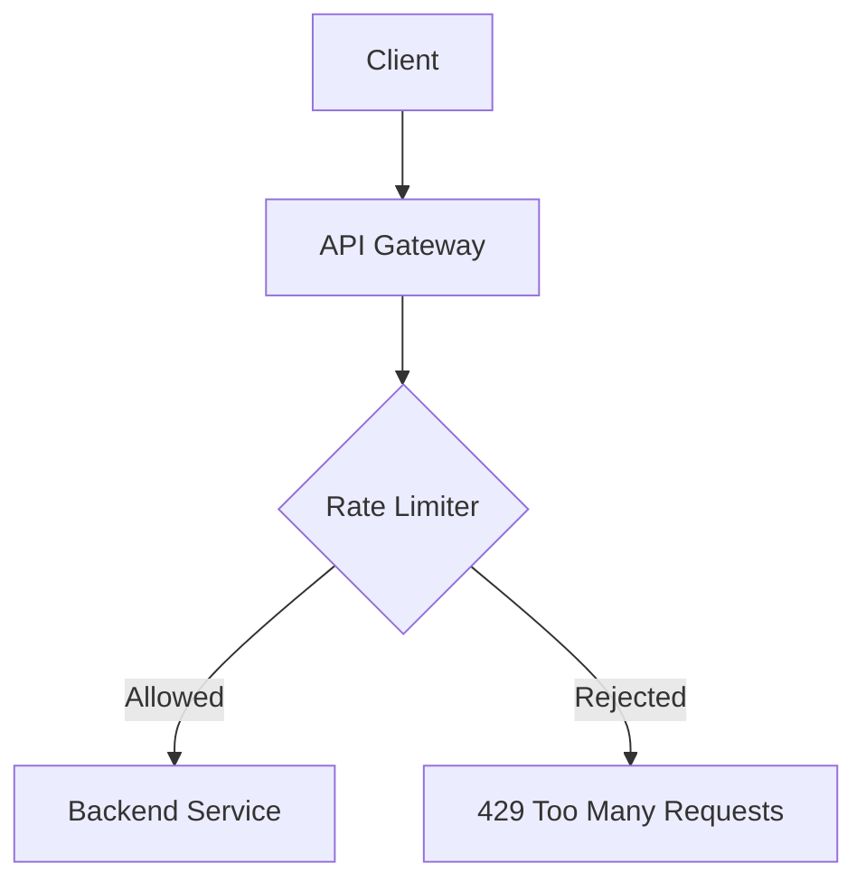
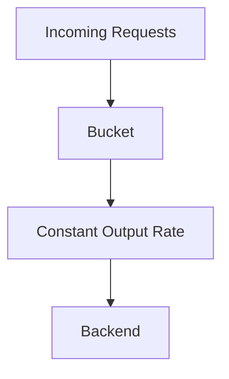
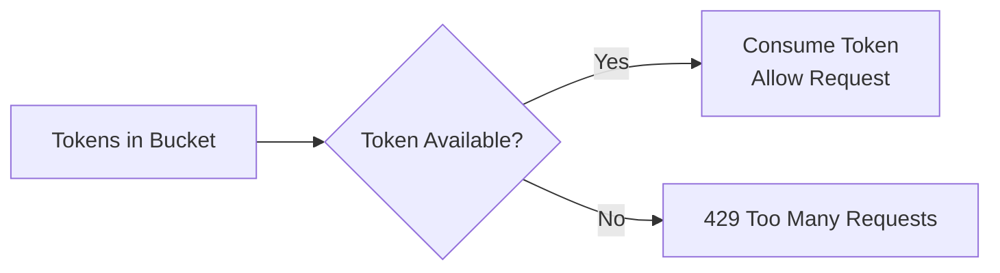
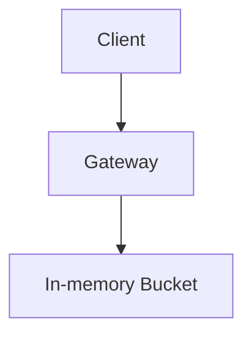
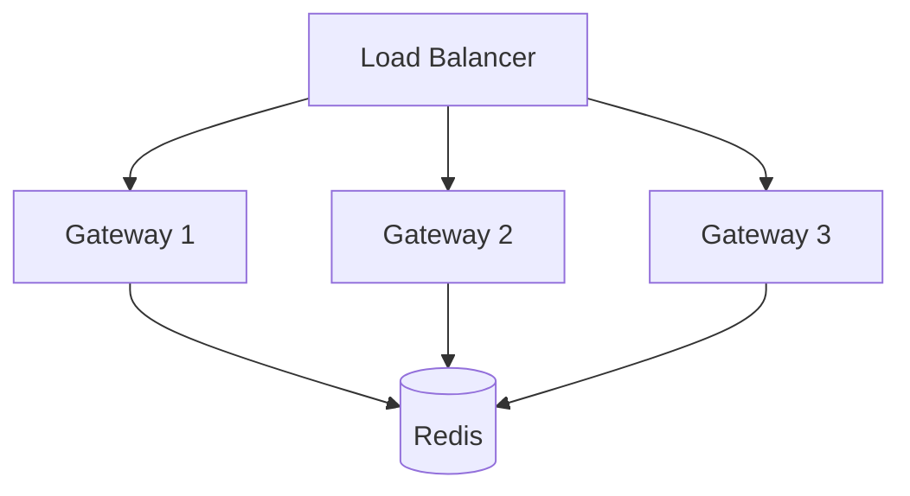
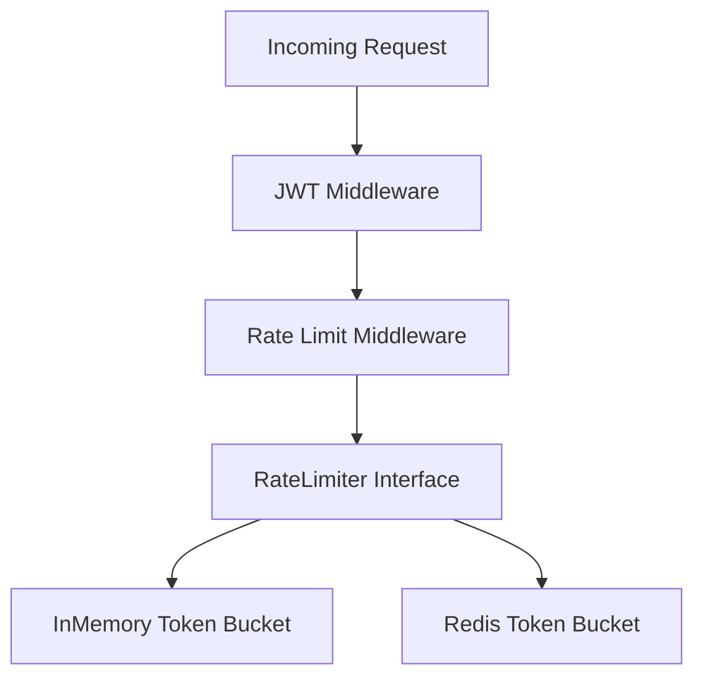

# Day 7

## Redis & Rate Limiting Fundamentals

## Learning Objectives
- Understand why rate limiting is needed.
- Compare Fixed Window, Sliding Window, Leaky Bucket, and Token Bucket.
- Learn Redis TTL, distributed state, atomicity, and Lua scripts.
- Design a Redis-independent `RateLimiter` interface.
- Configure per-route limits in YAML.
- Learn deterministic testing with injected clocks and Go race detector.

---

# Why Rate Limiting?



**Purpose**
- Protect backend services
- Prevent abuse and DDoS-like traffic
- Ensure fairness
- Avoid database overload

---

# HTTP Status Codes

| Code | Meaning |
|------|---------|
|401|Unauthenticated|
|403|Authenticated but forbidden|
|429|Rate limit exceeded|
|500|Internal server error|

---

# Rate Limiting Algorithms

## 1. Fixed Window

```mermaid
timeline
    title Fixed Window
    12:00:59 : Req1 Req2 Req3 Req4 Req5 
    12:01:00 : Counter Reset
    12:01:00 : Req6 Req7 Req8 Req9 Req10 
```

### Pros
- Very simple
- Low memory
- Fast

### Cons
- Burst problem at window boundaries.

---

## 2. Sliding Window

Looks at the **last N seconds** instead of resetting.

### Pros
- Fairer
- Prevents most bursts

### Cons
- More memory and computation.

---

## 3. Leaky Bucket



- Smooth traffic
- Requests may wait
- Bucket full => new requests rejected

---

## 4. Token Bucket  (Chosen)



### Rules
- Every request consumes one token.
- Tokens refill over time.
- Allows short bursts.
- Controls long-term rate.

### Example
- Capacity = 5
- Current Tokens = 2
- 3 requests arrive
- First 2 allowed
- Third rejected

---

# Algorithm Comparison

| Algorithm | Burst | Fairness | Used in Helix |
|------------|-------|----------|---------------|
|Fixed Window|Poor|Low|No|
|Sliding Window|Good|High|No|
|Leaky Bucket|Smooth|Good|No|
|Token Bucket|Excellent|Excellent|Yes|

---

# Why Redis?

Single gateway:



Multiple gateways:



Redis provides **shared state** so all gateways use the same bucket.

---

# Redis TTL

```text
ratelimit:user123
TTL = 60s

Inactive user
↓
Redis deletes key automatically
```

Benefits:
- Frees memory
- Removes stale buckets
- No cleanup jobs

---

# Race Condition

Without atomicity:

```text
Token = 1

Request A -> Reads 1
Request B -> Reads 1

Both consume token 
```

Need atomic operations.

---

# Redis Lua Scripts

Lua executes:

1. Read bucket
2. Refill tokens
3. Check availability
4. Consume token
5. Save bucket

as **one atomic operation**.

---

# RateLimiter Interface

```go
type RateLimiter interface {
    Allow(ctx context.Context, key string) (bool, error)
}
```

Middleware depends on the interface, not Redis.

---

# Architecture



---

# Key Strategies

| Strategy | Example | Use Case |
|-----------|---------|----------|
|Authenticated User|user:123|Protected APIs|
|API Key|apikey:abc|Public APIs|
|IP|ip:203.0.113.5|Login/Register|
|Global|global|Whole service|

---

# YAML Example

```yaml
routes:
  users:
    path: /users
    authenticated: true

    rate_limit:
      capacity: 20
      refill_rate: 10
      key: user
```

---

# Testing

## Injected Clock

Why?

- Avoid flaky tests
- Advance time instantly
- Deterministic tests

Instead of:

```go
time.Now()
```

Use:

```text
Real Clock (Production)
Fake Clock (Tests)
```

---

## Race Detector

```bash
go test -race ./...
```

Detects unsafe concurrent access.

---

# Key Takeaways

- Rate limiting protects backend services.
- Token Bucket is the best choice for API gateways.
- Redis enables distributed rate limiting.
- TTL automatically removes inactive buckets.
- Lua scripts ensure atomic updates.
- Always design using interfaces.
- Test with fake clocks.
- Verify concurrency with Go race detector.

---
