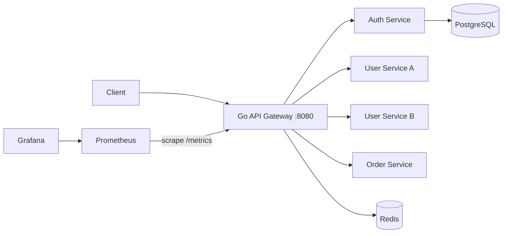
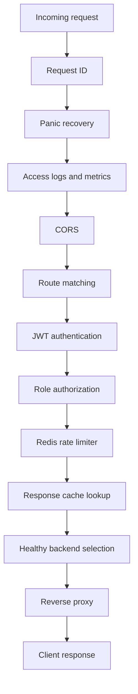

# Helix -> Go API Gateway

> A production-inspired API gateway built from scratch in Go to explore reverse proxying, middleware, authentication, distributed rate limiting, load balancing, caching, observability, and resilient system design.

## Why this project?

Clients in a microservice system should not need to know the address and security rules of every backend. They communicate with one gateway, which provides a consistent entry point for routing, authentication, traffic control, resilience, and monitoring.

## Architecture



### Request lifecycle



## Core features

- Declarative path-based routing
- HTTP reverse proxy
- Request and response header management
- Request IDs and structured JSON logging
- Panic recovery and CORS
- JWT authentication and role-based authorization
- PostgreSQL-backed authentication service
- Distributed Redis token-bucket rate limiting
- Concurrency-safe round-robin load balancing
- Active backend health checks
- Redis response caching for selected public routes
- YAML configuration with safe hot reload
- Prometheus metrics and Grafana dashboard
- Graceful shutdown and dependency readiness checks
- Unit, integration, race, fuzz, and load testing
- Docker Compose development environment
- GitHub Actions CI

## Technology stack

| Area | Technology |
|---|---|
| Language | Go 1.26.4 or newer supported patch release |
| HTTP server | Standard library `net/http` |
| Reverse proxy | `net/http/httputil.ReverseProxy` |
| Configuration | YAML |
| Authentication | JWT using `golang-jwt/jwt/v5` |
| Authorization | Route-level roles and claims |
| Database | PostgreSQL |
| Database driver | `pgx/v5` |
| Password hashing | `golang.org/x/crypto` |
| Distributed state | Redis |
| Metrics | Prometheus Go client |
| Dashboards | Grafana |
| Logging | Structured JSON with `log/slog` |
| Containers | Docker and Docker Compose |
| Testing | `testing`, `httptest`, race detector, fuzz tests |
| CI | GitHub Actions |
| Load testing | k6, Vegeta, or hey |

## Planned repository structure

```text
api-gateway/
├── cmd/
│   ├── gateway/
│   ├── auth-service/
│   └── mock-service/
├── internal/
│   ├── auth/
│   ├── cache/
│   ├── config/
│   ├── health/
│   ├── loadbalancer/
│   ├── middleware/
│   ├── observability/
│   ├── proxy/
│   ├── ratelimit/
│   └── router/
├── configs/
│   ├── gateway.yaml
│   ├── prometheus.yml
│   └── grafana/
├── migrations/
├── tests/
│   └── integration/
├── scripts/
├── docs/
├── .github/workflows/
├── Dockerfile
├── compose.yaml
├── Makefile
├── go.mod
├── go.sum
└── README.md
```

## Example route configuration

```yaml
server:
  address: ":8080"
  read_header_timeout: 5s
  idle_timeout: 60s

routes:
  - id: users
    path_prefix: /users
    strip_prefix: true
    auth:
      required: true
      roles: [user, admin]
    rate_limit:
      capacity: 20
      refill_per_second: 5
      key: user
    cache:
      enabled: false
    backends:
      - url: http://user-service-1:8080
        health_path: /healthz
      - url: http://user-service-2:8080
        health_path: /healthz

  - id: catalog
    path_prefix: /catalog
    auth:
      required: false
    rate_limit:
      capacity: 60
      refill_per_second: 10
      key: ip
    cache:
      enabled: true
      ttl: 30s
    backends:
      - url: http://catalog-service:8080
        health_path: /healthz
```

# 20-day implementation roadmap

The percentage represents approximate cumulative completion of the `v0.1.0` scope, not lines of code.

## Day 1 - Project foundation

**Target completion: 5%**

- [ ] Initialize the Go module and repository structure.
- [ ] Create gateway and mock-service entry points.
- [ ] Add `/healthz` and `/readyz` endpoints.
- [ ] Add JSON response and error helpers.
- [ ] Add initial unit tests with `httptest`.
- [ ] Add commands for formatting, testing, vetting, and running.

**Done when:** Both applications start, health tests pass, and the mock service identifies the request it receives.

## Day 2 - Reverse proxy

**Target completion: 10%**

- [ ] Forward requests to one configured backend.
- [ ] Use `httputil.ReverseProxy` with its `Rewrite` API.
- [ ] Preserve methods, bodies, and valid query parameters.
- [ ] Create trusted forwarding headers.
- [ ] Add proxy and server timeouts.
- [ ] Return a structured `502 Bad Gateway` when the backend fails.

**Done when:** GET and POST requests reach the backend and unavailable-backend tests pass.

## Day 3 - Routing and YAML configuration

**Target completion: 15%**

- [ ] Load routes and backends from YAML.
- [ ] Validate all configuration at startup.
- [ ] Implement deterministic longest-prefix matching.
- [ ] Support optional path-prefix stripping.
- [ ] Return structured `404` and `503` errors.
- [ ] Add table-driven routing tests.

**Done when:** `/users/*` and `/orders/*` reliably reach different services, including edge-case paths.

## Day 4 - Middleware

**Target completion: 20%**

- [ ] Define a composable middleware type and chain.
- [ ] Add request-ID generation and propagation.
- [ ] Add panic recovery.
- [ ] Add structured JSON access logs.
- [ ] Add configurable CORS with an explicit origin allowlist.
- [ ] Test middleware order and response-status capture.

**Done when:** Every response and access log has the same request ID, and a handler panic does not terminate the server.

## Day 5 - Authentication service and PostgreSQL

**Target completion: 25%**

- [ ] Add PostgreSQL to the development stack.
- [ ] Create a versioned users-table migration.
- [ ] Implement registration and login endpoints.
- [ ] Hash passwords securely.
- [ ] Issue short-lived, asymmetrically signed JWTs.
- [ ] Add successful and failed authentication tests.

**Done when:** A user can register, log in, and receive a valid JWT without plaintext passwords or private keys appearing in logs or Git.

## Day 6 - JWT authorization

**Target completion: 30%**

- [ ] Validate JWT signature, algorithm, issuer, audience, expiry, and not-before.
- [ ] Support public and protected route policies.
- [ ] Add role-based authorization.
- [ ] Store a typed principal in request context.
- [ ] Forward only trusted identity headers.
- [ ] Test missing, malformed, expired, and unauthorized tokens.

**Done when:** Protected routes return correct `401` and `403` responses and valid users reach the backend.

## Day 7 - Rate-limiter foundation

**Target completion: 35%**

- [ ] Add Redis and dependency readiness checks.
- [ ] Define a rate-limiter interface.
- [ ] Implement an in-memory token bucket for learning and unit testing.
- [ ] Inject a clock for deterministic refill tests.
- [ ] Add per-route limit configuration.
- [ ] Support user- and IP-based limiter keys.

**Done when:** Token consumption and refill behavior pass deterministic unit and race tests.

## Day 8 - Distributed Redis rate limiting

**Target completion: 40%**

- [ ] Implement the token bucket as one atomic Redis Lua operation.
- [ ] Expire inactive limiter keys.
- [ ] Return `429 Too Many Requests` and rate-limit headers.
- [ ] Define fail-open or fail-closed behavior per route type.
- [ ] Add concurrency and Redis-outage integration tests.

**Done when:** Multiple concurrent gateway requests cannot exceed the configured shared limit.

## Day 9 - Round-robin load balancing

**Target completion: 45%**

- [ ] Support multiple backends for each route.
- [ ] Define a load-balancer interface.
- [ ] Implement concurrency-safe round robin.
- [ ] Record the selected backend in request context.
- [ ] Test deterministic distribution across three instances.
- [ ] Run high-concurrency tests with the race detector.

**Done when:** Requests rotate across healthy instances with no data races.

## Day 10 - Health checks and shutdown

**Target completion: 50%**

- [ ] Add active backend health probes with timeouts.
- [ ] Add consecutive failure and recovery thresholds.
- [ ] Exclude unhealthy backends from selection.
- [ ] Restore recovered backends automatically.
- [ ] Implement graceful server shutdown.
- [ ] Stop all background workers without goroutine leaks.

**Done when:** Traffic automatically moves away from a stopped backend and returns after it recovers.

## Day 11 - Dynamic configuration

**Target completion: 55%**

- [ ] Watch the YAML configuration file with debounce.
- [ ] Parse and validate a complete new configuration snapshot.
- [ ] Publish valid snapshots atomically.
- [ ] Keep the last valid configuration after a failed reload.
- [ ] Reconcile health-check workers safely.
- [ ] Add reload success and failure logs.

**Done when:** Routes change without restarting the gateway and invalid updates do not affect live traffic.

## Day 12 - Response caching

**Target completion: 60%**

- [ ] Cache only explicitly enabled public `GET` or `HEAD` routes.
- [ ] Create deterministic cache keys.
- [ ] Store status, approved headers, and bounded response bodies.
- [ ] Respect TTL, `private`, `no-store`, and `Set-Cookie` restrictions.
- [ ] Add `X-Cache: HIT`, `MISS`, or `BYPASS`.
- [ ] Test expiry, query separation, and private-response bypass.

**Done when:** A cache hit avoids the backend without leaking private or user-specific responses.

## Day 13 - Metrics and dashboards

**Target completion: 65%**

- [ ] Expose a protected or internal `/metrics` endpoint.
- [ ] Track request rate, errors, and duration.
- [ ] Track backend failures and health.
- [ ] Track limiter decisions and cache results.
- [ ] Add Prometheus scraping configuration.
- [ ] Provision a Grafana data source and gateway dashboard.

**Done when:** Test traffic changes every relevant dashboard panel and metric labels remain bounded.

## Day 14 - Docker Compose platform

**Target completion: 70%**

- [ ] Create multi-stage, non-root Docker images.
- [ ] Add the gateway and demo services to Compose.
- [ ] Add PostgreSQL, Redis, Prometheus, and Grafana.
- [ ] Add container health checks, networks, and volumes.
- [ ] Use service DNS names instead of container-local `localhost`.
- [ ] Add `.dockerignore` and `.env.example`.

**Done when:** One documented command starts the complete local platform from a clean state.

## Day 15 - Integration testing

**Target completion: 75%**

- [ ] Test login followed by a protected gateway request.
- [ ] Test per-user rate-limit isolation.
- [ ] Test backend failure and recovery.
- [ ] Test cache miss, hit, and expiry.
- [ ] Test invalid configuration and dependency outages.
- [ ] Add one command for repeatable integration testing.

**Done when:** The full suite passes twice from a clean environment without state leakage.

## Day 16 - Security hardening

**Target completion: 80%**

- [ ] Add request-body and header limits.
- [ ] Review server, transport, and health-check timeouts.
- [ ] Protect admin endpoints.
- [ ] Prevent request-controlled backend destinations.
- [ ] Add config or parser fuzz tests.
- [ ] Run `govulncheck`, `go vet`, and race tests.
- [ ] Document the threat model and trust boundaries.

**Done when:** Malformed and oversized requests fail safely, scans pass, and the security assumptions are documented.

## Day 17 - Performance and profiling

**Target completion: 85%**

- [ ] Add repeatable load-test scripts.
- [ ] Measure direct-backend and gateway latency.
- [ ] Measure proxy-only, JWT, limiter, and cache-hit scenarios.
- [ ] Capture throughput, p50, p95, p99, and error rate.
- [ ] Profile an observed bottleneck before optimizing it.
- [ ] Document hardware, duration, concurrency, and commands.

**Done when:** Performance claims can be reproduced and are presented as local benchmark results, not production guarantees.

## Day 18 - Continuous integration

**Target completion: 90%**

- [ ] Add formatting, vet/lint, unit-test, and build jobs.
- [ ] Add race-detector and vulnerability-scan jobs.
- [ ] Add integration tests with required services.
- [ ] Build the Docker image in CI.
- [ ] Use minimal workflow permissions.
- [ ] Add a CI status badge after the workflow is live.

**Done when:** Pull requests cannot silently merge code that fails tests, race checks, or security scanning.

## Day 19 - Documentation and demo

**Target completion: 95%**

- [ ] Document installation and quick start.
- [ ] Document configuration and API examples.
- [ ] Add architecture and request-flow diagrams.
- [ ] Add dashboard screenshots and sample structured logs.
- [ ] Record major architecture decisions.
- [ ] Add troubleshooting and known limitations.
- [ ] Prepare a short terminal demo or GIF.

**Done when:** Someone unfamiliar with the repository can run and understand it without additional instructions.

## Day 20 - Release `v0.1.0`

**Target completion: 100%**

- [ ] Run all unit, integration, race, fuzz, and security checks.
- [ ] Test setup from a fresh clone.
- [ ] Verify authentication, routing, limiting, caching, and failover.
- [ ] Verify Prometheus and Grafana behavior.
- [ ] Remove secrets, temporary files, and debug code.
- [ ] Publish release notes and tag `v0.1.0`.
- [ ] Prepare a three-minute demo and technical interview walkthrough.

**Done when:** CI is green, the clean-room demo works, documentation matches the code, and `v0.1.0` is reproducible.

## Milestones

| Milestone | Day | Result |
|---|---:|---|
| Proxy foundation | 3 | Requests route to multiple services through a tested proxy |
| Secure traffic control | 8 | JWT, PostgreSQL auth, and Redis rate limiting work |
| Resilient gateway | 12 | Load balancing, health checks, reload, and caching work |
| Operable platform | 15 | Compose, metrics, dashboards, and integration tests work |
| Portfolio release | 20 | Security, benchmarks, CI, documentation, and release are complete |

## `v0.1.0` acceptance checklist

- [ ] Requests route to the correct service.
- [ ] Request method, body, query, and approved headers are preserved.
- [ ] Protected routes reject invalid and expired JWTs.
- [ ] Role policies return correct `401` and `403` responses.
- [ ] Redis enforces shared request limits atomically.
- [ ] Round robin is concurrency-safe.
- [ ] Unhealthy backends receive no new requests.
- [ ] Selected public responses are cached safely.
- [ ] Invalid configuration reloads are rejected atomically.
- [ ] Logs correlate requests through request IDs.
- [ ] Prometheus and Grafana show traffic and failures.
- [ ] The stack starts through Docker Compose.
- [ ] Unit, integration, race, and security checks pass.
- [ ] No secrets are committed.
- [ ] A fresh user can follow the quick start successfully.

## Scope after `v0.1.0`

Planned advanced work will be handled separately so it does not weaken the first release:

- OIDC and JWKS key rotation
- Retry policies and circuit breaking
- Least-connections balancing
- OpenTelemetry distributed tracing
- WebSocket and gRPC proxying
- Service discovery
- API keys and IP allowlists
- TLS automation
- Kubernetes and Helm deployment

## License
A license will be selected before the first public release.
